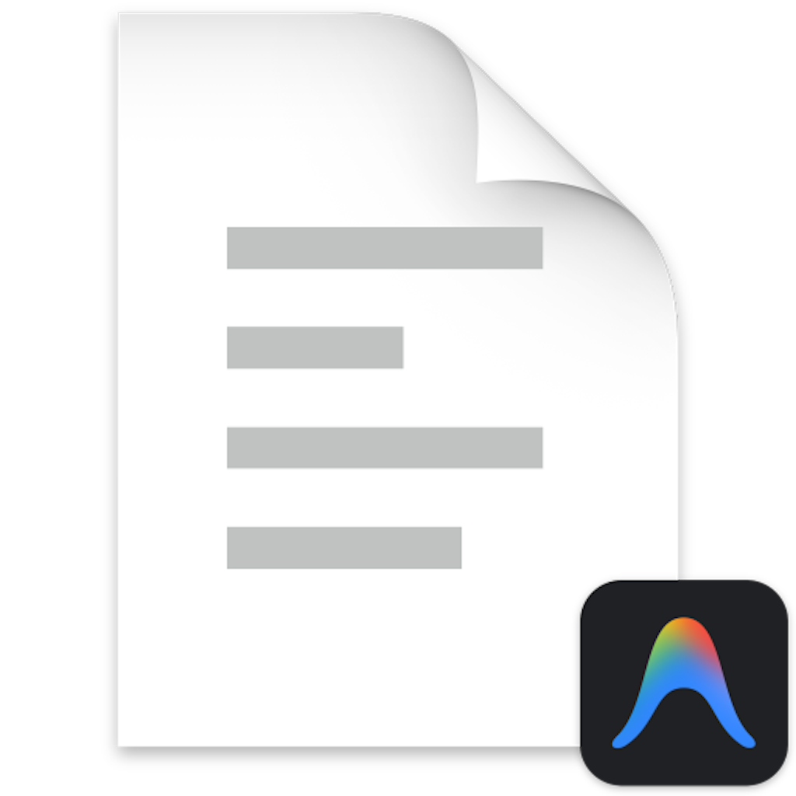

<p align="center">
  
</p>

<h1 align="center">Claude Map</h1>

<p align="center">
  Visual dashboard for inspecting and mapping Claude Code project configurations.
  <br>
  See your global settings, commands, skills, hooks, permissions, and MCP servers at a glance — and visualize how any project connects to your global Claude config.
</p>

<p align="center">
  <a href="https://www.npmjs.com/package/claude-map"></a>
  <a href="https://www.npmjs.com/package/claude-map"></a>
  <a href="https://github.com/shamim0902/claude-map/blob/main/LICENSE"></a>
</p>

---

## Install

```bash
npm install -g claude-map
```

Or run without installing:

```bash
npx claude-map
```

Then open **http://localhost:3131** in your browser.

### CLI Options

```bash
claude-map                # Start on default port 3131
claude-map -p 8080        # Start on custom port
claude-map --help         # Show help
claude-map --version      # Show version
```

## Features

- **Connection Map** — interactive 3-layer diagram showing how a project relates to global Claude settings
- **Enhanced Skills** — view allowed-tools, argument-hint, agent delegation; compare global vs project skills
- **Session History** — browse past conversations with tool call timelines and conversation replay
- **Command History** — every prompt you've typed, grouped by day
- **Analytics** — model usage breakdown, hourly activity heatmap, tool frequency chart
- **Team Sharing** — export/import skills and commands as bundles for your team
- **Dark / Light theme** — toggle with one click, persisted across sessions
- **Live updates** — file changes in `~/.claude/` auto-refresh the dashboard via SSE
- **Directory browser** — add projects by browsing your filesystem
- **Raw file viewer** — browse and read any file in the `.claude/` tree with syntax highlighting
- **JSON export** — download the full scan result for any project

## Usage Guide

### Global Config

When the app loads, it automatically scans your `~/.claude/` directory. Click **Global Config** in the sidebar to return to this view at any time.

### Adding Projects

Click **+** in the sidebar to open the directory browser. Navigate to any project folder and click **Select This Folder**. Each project shows a status icon:

| Icon | Color | Meaning |
|------|-------|---------|
| **◈** | Green | Full — has `.claude/`, `CLAUDE.md`, and `settings.local.json` |
| **◈** | Yellow | Partial — has `.claude/` but missing some files |
| **○** | Orange | None — directory exists but no `.claude/` directory |
| **✗** | Red | Missing — path does not exist on disk |

### Project Map

Selecting a project opens the **Map** tab — a visual connection diagram:

- **Solid teal lines** = inherited from global config
- **Dashed blue lines** = project-specific configuration
- **Dashed gray lines** = absent (node not configured)
- Click any node to expand a detail panel

### Skills (Enhanced)

The Skills tab shows YAML frontmatter metadata:
- **allowed-tools** — which tools the skill can use (e.g., `Bash(git *)`, `Read`, `Grep`)
- **argument-hint** — expected arguments when invoking the skill
- **agent** — if the skill delegates to a separate agent
- **Global vs Project comparison** — see which skills exist where

Export any skill as `.md` to share with teammates, or import skills via paste/drag-drop.

### Sessions

Browse all past Claude Code conversations per project:
- Session list with title, git branch, model, message count, duration
- Click to view full conversation timeline with tool call badges
- Toggle to **Command History** to see every prompt grouped by day

### Stats

- **Model usage breakdown** — token counts per model (Opus, Sonnet, Haiku)
- **Hourly activity heatmap** — when you're most active
- **Tool frequency chart** — most-used tools across all sessions
- Daily activity chart and detail table

### Team Sharing

- **Export Bundle** — select Skills + Commands + CLAUDE.md, download as JSON
- **Import Bundle** — paste or drag-drop a `.json` bundle into the Import modal
- **Single Skill Export** — download any skill as `.md` from its card

### Tabs

| Tab | Description |
|-----|-------------|
| **Map** | Visual connection diagram (project view only) |
| **Overview** | Metric cards, CLAUDE.md preview, config summary |
| **Commands** | Slash commands with search filter |
| **Skills** | Skills with metadata, global/project comparison, export/import |
| **Plans** | Plan files from `~/.claude/plans/` |
| **Sessions** | Conversation history browser and command history |
| **Settings** | Permissions, hooks, model config |
| **MCP & Plugins** | Installed plugins, MCP servers, marketplaces |
| **Stats** | Activity charts, model usage, tool frequency |
| **Raw** | File tree browser with syntax-highlighted viewer |

## API Reference

| Method | Endpoint | Description |
|--------|----------|-------------|
| `GET` | `/api/scan` | Full scan of `~/.claude/`. Add `?project=<path>` for project data |
| `GET` | `/api/analyze?project=<path>` | Project analysis with connection map data |
| `GET` | `/api/project-status?path=<path>` | Fast status check |
| `GET` | `/api/sessions?project=<path>` | List session history |
| `GET` | `/api/sessions/:id?project=<path>` | Full conversation timeline |
| `GET` | `/api/history` | Command history. Add `?project=<path>` to filter |
| `GET` | `/api/stats/tools` | Tool usage frequency |
| `GET` | `/api/skills/export?name=<name>&scope=<scope>` | Download skill as `.md` |
| `POST` | `/api/skills/import` | Import a skill |
| `POST` | `/api/export/bundle` | Export skills+commands bundle |
| `POST` | `/api/import/bundle` | Import a bundle |
| `GET` | `/api/file?path=<file>` | Read a file |
| `GET` | `/api/export` | Download full scan as JSON |
| `GET` | `/api/events` | SSE stream for live updates |

## Project Structure

```
claude-map/
├── bin/
│   └── cli.js             # CLI entry point (npx claude-map)
├── public/
│   ├── index.html          # HTML shell
│   ├── app.js              # Frontend SPA
│   ├── style.css           # Dual-theme CSS
│   └── logo.png            # Logo
├── server.js               # Express backend
├── package.json
├── LICENSE
└── .github/
    └── workflows/
        └── release.yml     # Auto-publish on "release:" commit
```

## Configuration

| Setting | Default | Description |
|---------|---------|-------------|
| `PORT` | `3131` | Server port (env variable or `-p` flag) |

Pinned projects are stored in `~/.claude/inspector-projects.json`.

## Release Workflow

This project uses a GitHub Actions workflow that automatically publishes to npm when a commit message starts with `release:`.

To release a new version:

```bash
# 1. Update version in package.json
npm version patch   # or minor / major

# 2. Commit and push with "release:" prefix
git add -A
git commit -m "release: v3.0.1"
git push
```

The workflow will:
1. Publish to npm with `npm publish --access public`
2. Create a GitHub Release with the version tag

**Setup required:** Add `NPM_TOKEN` as a repository secret in GitHub Settings > Secrets.

## Tech Stack

- **Runtime:** Node.js 18+
- **Server:** Express 4
- **File watching:** chokidar 3
- **Frontmatter parsing:** gray-matter 4
- **Markdown rendering:** marked 9 (CDN)
- **Syntax highlighting:** highlight.js 11 (CDN)
- **Frontend:** Vanilla JavaScript, CSS custom properties, no build step

## License

[MIT](LICENSE)
